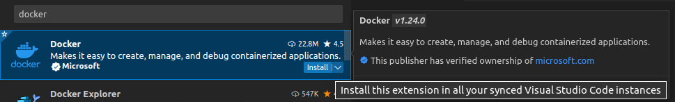
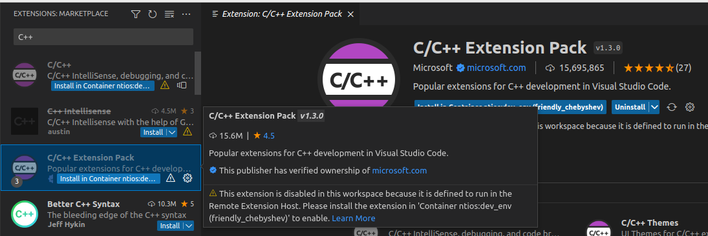
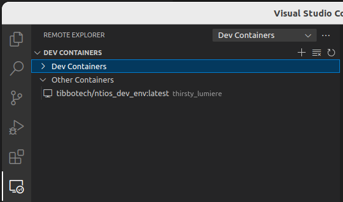
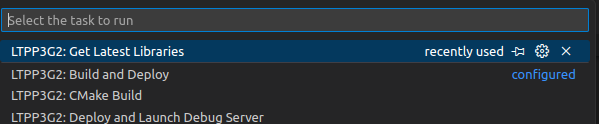
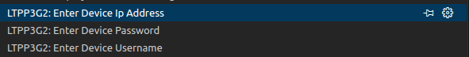
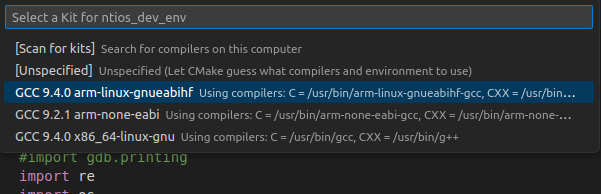

# Getting Started with ntios development.

## Introduction
This repository contains scripts and other tools used to create apps for Tibbo's [Ubuntu-based distribution](https://tibbo.com/store/tps/ltpp3g2/ubuntu.html) for the [Size 3 Linux Tibbo Project PCB (LTPP3), Gen. 2](https://tibbo.com/store/tps/ltpp3g2.html).

If you just want to download the latest version of our distribution in binary form to flash your device, [click here (direct download)](https://github.com/tibbotech/LTPP3_ROOTFS/releases/download/v0.6.0/ISPBOOOT.BIN).

## System Requirements 
* Windows / Linux 
  * Visual Studio Code
  * Docker Desktop (Windows) / Docker for Linux


## Getting Started
From From your terminal run the following command: 
```shell
docker pull tibbotech/ntios_dev_env:latest
docker run -it tibbotech/ntios_dev_env:latest /bin/bash
```


If you are using windows please use docker desktop. 

* Open VSCode 
* Use the extensions marketplace to install the docker extension.
  * 
* Make sure to "Install in Container" the C++ Extension Pack from Microsoft.
  * 
* Attach vscode to the container using the Docker extension. 
  * 
* Open the folder /root/ntios_dev_env
  * 
* Get the latest version of the ntios libraries by running the task: Get Libraries. 
  * 
* Configure your device
  * Run the following 3 tasks. 
  * 
* Configure the project
  * Run the CMAKE Configure task. 
  * Select the compiler kit
    * 


With you device confifured press F5. This will cause the device to begin debugging. 


Enjoy our building apps on your LTPP3(G2).